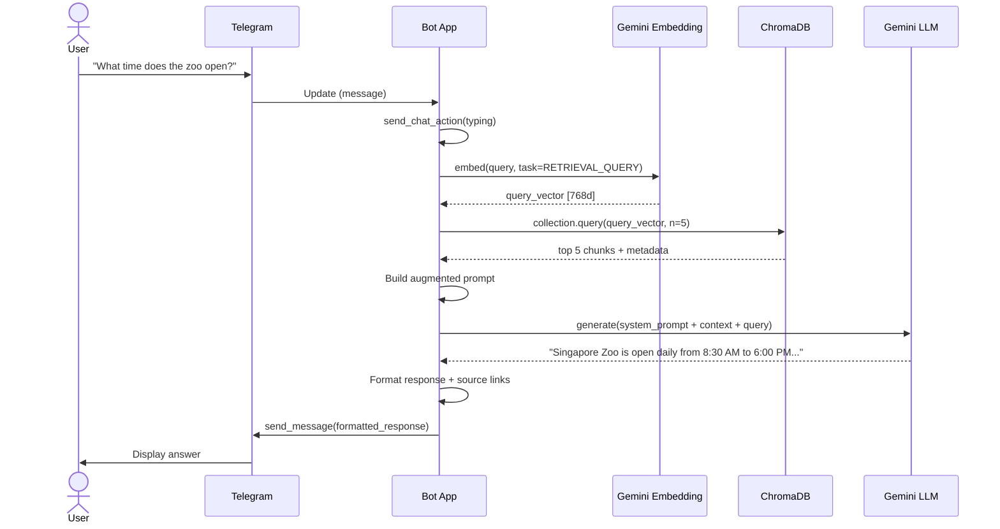

# Mandai Zoo AI Chatbot — Design Document

## 1. Overview

A **Retrieval-Augmented Generation (RAG)** Telegram chatbot that answers user queries about Singapore Zoo (and the broader Mandai Wildlife Reserve) by grounding every response in content scraped from `mandai.com`.

### Core Principle
> **Never hallucinate. Always cite.** If the knowledge base doesn't contain the answer, say so and point the user to the official website.

---

## 2. Architecture

```
┌──────────────┐       ┌──────────────────┐       ┌──────────────────┐
│              │       │                  │       │                  │
│   Telegram   │◄─────►│  Bot Application │◄─────►│   Gemini API     │
│   User       │       │  (Python)        │       │   (LLM)          │
│              │       │                  │       │                  │
└──────────────┘       └───────┬──────────┘       └──────────────────┘
                               │
                               │ query embedding
                               ▼
                       ┌──────────────────┐
                       │                  │
                       │    ChromaDB      │
                       │  (Vector Store)  │
                       │                  │
                       └───────┬──────────┘
                               │
                               │ populated by
                               ▼
                       ┌──────────────────┐
                       │                  │
                       │  Scraper /       │
                       │  Ingestion       │
                       │  Pipeline        │
                       │                  │
                       └──────────────────┘
```

### Component Breakdown

| Component | Tech | Responsibility |
|---|---|---|
| **Telegram Interface** | `python-telegram-bot` (v20+, async) | Receive messages, send responses, handle `/start`, `/help` commands |
| **Bot Application** | Python 3.11+ | Orchestrates the RAG pipeline: embed query → retrieve → augment prompt → call LLM → respond |
| **LLM** | Google Gemini API (`gemini-2.0-flash` or `gemini-2.5-flash`) | Generate natural-language answers conditioned on retrieved context |
| **Vector Store** | ChromaDB (persistent, local) | Store and retrieve document embeddings |
| **Embeddings** | Google `text-embedding-004` via Gemini API (or ChromaDB's default) | Convert text chunks into vector representations |
| **Scraper / Ingestion** | `requests` + `BeautifulSoup4` (or `crawl4ai`) | Crawl mandai.com pages, clean HTML, chunk text, embed, and store |

---

## 3. Data Ingestion Pipeline

### 3.1 Target Pages (Sitemap)

The scraper should crawl these key sections under `https://www.mandai.com/en/singapore-zoo/`:

| Category | URLs | Content Type |
|---|---|---|
| **Home** | `/singapore-zoo.html` | Overview, hero descriptions |
| **Plan Your Visit** | `/singapore-zoo/plan-your-visit.html` | Opening hours, getting there, parking, accessibility |
| **Things To Do** | `/singapore-zoo/things-to-do.html` | Shows, feeding sessions, tram rides |
| **Animals & Zones** | `/singapore-zoo/animals-and-zones.html` | Animal species list, zone descriptions |
| **Tickets & Passes** | `/tickets-and-passes/single-attractions.html`, `/tickets-and-passes/multi-attractions.html` | Pricing tiers, combo deals |
| **FAQ** | `/faq.html` | Common visitor questions |
| **Getting Here** | `/plan-your-visit/getting-to-and-around.html` | Transport options, shuttle info |
| **Dining** | `/dine-and-shop/dining-outlets.html` | Restaurant listings |

> **Approach:** Start with a seed URL list (above). Optionally, follow internal links one level deep to capture sub-pages (e.g., individual animal pages). Cap total pages to avoid scope creep — ~30-50 pages is a good starting target.

### 3.2 Scraping Strategy

```python
# Pseudocode
for url in seed_urls:
    html = requests.get(url)
    soup = BeautifulSoup(html, 'html.parser')

    # Remove nav, footer, scripts, styles
    for tag in soup.select('nav, footer, script, style, .cookie-banner'):
        tag.decompose()

    # Extract main content
    main = soup.select_one('main') or soup.select_one('[role="main"]') or soup.body
    text = main.get_text(separator='\n', strip=True)

    # Store with metadata
    documents.append({
        'text': text,
        'source_url': url,
        'page_title': soup.title.string,
        'scraped_at': datetime.utcnow().isoformat()
    })
```

**Key decisions:**
- **Strip navigation chrome** — the mandai.com pages have extensive mega-menus that repeat across every page. These MUST be removed before chunking, otherwise they dominate the vector space with noise.
- **Preserve structure** — keep headings, lists, and paragraph breaks as `\n` separators so chunks retain semantic boundaries.
- **Respect robots.txt** — add a polite `User-Agent` and a small delay between requests.

### 3.3 Chunking Strategy

#### Why NOT a fixed chunk size

A generic 500–800 char chunk size is a common starting point, but analysis of the **actual scraped mandai.com content** reveals three distinct content shapes with very different natural sizes:

| Content Type | Example | Typical Size | Count on Site |
|---|---|---|---|
| **Animal descriptions** | "Bornean orangutan — Orangutans are apes, which means that unlike monkeys, they do not have a tail..." | **80–300 chars** | ~80+ entries |
| **FAQ Q&A pairs** | "Q: Where are the attractions located? A: Bird Paradise is at 20 Mandai Lake Road..." | **150–800 chars** | ~30+ pairs |
| **Zone/page descriptions** | "Fragile Forest — Get up-close to the denizens of a tropical rainforest..." | **200–600 chars** | ~15 zones |

A fixed 500-char chunk would **merge 2-3 animal entries** together, losing the clean "one animal = one chunk" boundary. A fixed 800-char chunk would **split some longer FAQ answers mid-sentence**.

#### Semantic-First Chunking Approach

Instead of character-based splitting, we use **content-aware parsing** that respects the natural boundaries of each page type:

```
Pipeline:
1. Detect page type from URL (FAQ, animal listing, general)
2. Parse into semantic units (heading+body, Q&A pair, animal entry)
3. Apply size guardrails:
   - If unit < 80 chars  → merge with adjacent unit (too small to embed meaningfully)
   - If unit < 1000 chars → keep as-is (one chunk)
   - If unit > 1000 chars → recursive split at ~500 chars with 100 char overlap
```

| Parameter | Value | Rationale |
|---|---|---|
| **Primary method** | Semantic splitting (heading-based, Q&A-based) | Preserves self-contained information units |
| **Fallback method** | Recursive character splitting | For oversized units that exceed the max cap |
| **Max chunk size** | ~1000 characters | Cap for when semantic units are unusually long |
| **Min chunk size** | ~80 characters | Floor — anything smaller gets merged with its neighbor |
| **Overlap (fallback only)** | ~100 characters | Only applied when a semantic unit is recursively split |
| **Separator hierarchy** | `["\n\n", "\n", ". ", " "]` | For the recursive fallback — paragraphs first, then sentences |

#### Page-Type-Specific Parsing

**FAQ pages** (URL contains `/faq/`):

Mandai's FAQ pages use an accordion UI where each question is a `<button>` / `<a>` element with `href="javascript:void(0)"`. In scraped markdown, this produces a reliable pattern:

```
[What are the operating hours for each attraction?](javascript:void(0))
Operating hours vary by attraction and season. Visit Singapore Zoo...

[Where are the wildlife attractions located at?](javascript:void(0))
Bird Paradise and Rainforest Wild Adventure are located at 20 Mandai Lake Road...
```

Detection approach:

```python
def parse_faq_page(text: str) -> list[dict]:
    """Split FAQ page into Q&A chunks using the javascript:void(0) accordion pattern."""
    import re
    parts = re.split(r'\[([^\]]+)\]\(javascript:void\(0\)\)', text)
    # parts[0] = preamble, then alternating: question, answer, question, answer...
    qa_pairs = []
    for i in range(1, len(parts), 2):
        question = parts[i].strip()
        answer = parts[i + 1].strip() if i + 1 < len(parts) else ""
        if question and answer:
            qa_pairs.append({
                "text": f"Q: {question}\nA: {answer}",
                "content_type": "faq"
            })
    return qa_pairs
```

Fallback chain if `javascript:void(0)` pattern breaks in the future:
1. **Primary**: `javascript:void(0)` link pattern (works today, robust for accordion UIs)
2. **Secondary**: Lines ending with `?` followed by non-question text
3. **Tertiary**: Treat as regular content, split by headings/paragraphs

**Animal/zone listing pages** (URL contains `/animals-and-zones`):

Each animal entry follows a `#### Heading` + 1-2 sentence description pattern. Split on `####` headings — each heading+body = one chunk.

**General content pages** (everything else):

Split on `##` / `###` headings. Each heading+body = one chunk, subject to the max/min size guardrails above.

#### 3.3.1 Chunk Analysis Dry-Run

Before embedding anything, the ingestion pipeline should include a **dry-run analysis step** that:

1. Scrapes and cleans all pages (no API calls)
2. Applies the semantic chunking logic
3. Outputs a distribution report:
   - Total chunk count
   - Min / median / mean / p95 / max chunk sizes (in chars)
   - Breakdown by `content_type` (faq, animal, ticket, general)
   - Sample of 5 random chunks for manual eyeballing
4. Flags any chunks that look problematic (e.g., chunk contains only nav links, or is suspiciously short)

This costs **zero API calls** and takes <30 seconds to run. Tune the chunking parameters based on the output before committing to embedding.

```bash
python -m scraper.ingest --dry-run   # analyze chunks without embedding
python -m scraper.ingest             # full run: scrape → chunk → embed → store
```

**Pricing/ticket pages**: Keep entire pricing sections as single chunks so the bot can answer "how much does X cost?" with full context. These are identified by URL (`/tickets-and-passes/`).

### 3.4 Metadata Per Chunk

Every chunk stored in ChromaDB will carry:

```python
{
    "source_url": "https://www.mandai.com/en/...",
    "page_title": "Animals and Zones - Singapore Zoo",
    "section": "Australasia Zone",        # extracted from nearest heading
    "content_type": "faq|animal|ticket|general",  # aids filtered retrieval
    "scraped_at": "2026-05-22T00:00:00Z"
}
```

This metadata enables:
- **Source citation** in bot responses ("According to [page title](url)...")
- **Filtered search** (e.g., restrict to `content_type=ticket` for pricing questions)
- **Staleness detection** (re-scrape if `scraped_at` is too old)

### 3.5 Embedding Model

| Option | Pros | Cons |
|---|---|---|
| **Google `text-embedding-004`** ✅ Recommended | High quality, 768 dims, same API key as Gemini, task-type parameter | Requires API call per chunk |
| **ChromaDB default (all-MiniLM-L6-v2)** | Zero config, runs locally, free | Lower quality, 384 dims, English-only |
| **Sentence-transformers** | Flexible, good quality | Extra dependency, more setup |

**Recommendation:** Use **`text-embedding-004`** from the Gemini API. Since you're already using a Gemini API key, it adds no extra configuration. It supports a `task_type` parameter which we can set to `RETRIEVAL_DOCUMENT` for indexing and `RETRIEVAL_QUERY` for search — this asymmetric approach improves retrieval quality.

### 3.6 Vector Storage (ChromaDB)

```python
import chromadb

client = chromadb.PersistentClient(path="./chroma_db")
collection = client.get_or_create_collection(
    name="mandai_zoo",
    metadata={"hnsw:space": "cosine"}  # cosine similarity
)

# Upsert chunks
collection.upsert(
    ids=[f"{url_hash}_{chunk_idx}" for ...],
    documents=[chunk.text for ...],
    metadatas=[chunk.metadata for ...],
    embeddings=[embed(chunk.text) for ...]  # pre-computed via Gemini
)
```

**Why ChromaDB:**
- Dead-simple setup — `pip install chromadb`, no server needed
- Persistent storage to disk — survives restarts
- Built-in metadata filtering
- Good enough for a corpus of ~200-500 chunks

---

## 4. Query Pipeline (Runtime Flow)

```
User message on Telegram
        │
        ▼
┌─────────────────────────────────┐
│ 1. PREPROCESS                   │
│    - Strip formatting           │
│    - Basic input validation     │
│    - Check for commands         │
└─────────┬───────────────────────┘
          │
          ▼
┌─────────────────────────────────┐
│ 2. EMBED QUERY                  │
│    - Gemini text-embedding-004  │
│    - task_type=RETRIEVAL_QUERY  │
└─────────┬───────────────────────┘
          │
          ▼
┌─────────────────────────────────┐
│ 3. RETRIEVE                     │
│    - ChromaDB similarity search │
│    - top_k=5                    │
│    - Include metadata           │
└─────────┬───────────────────────┘
          │
          ▼
┌─────────────────────────────────┐
│ 4. AUGMENT & GENERATE           │
│    - Build prompt with context  │
│    - Send to Gemini LLM         │
│    - Parse response             │
└─────────┬───────────────────────┘
          │
          ▼
┌─────────────────────────────────┐
│ 5. RESPOND                      │
│    - Format for Telegram        │
│    - Include source links       │
│    - Send to user               │
└─────────────────────────────────┘
```

### Retrieval Parameters

| Parameter | Value | Notes |
|---|---|---|
| `top_k` | 5 | Retrieve 5 most similar chunks. Enough for diverse context without overwhelming the prompt. |
| `distance_threshold` | 0.7 (cosine) | If best match is below this, flag as "low confidence" |
| `metadata_filter` | Optional | Could filter by `content_type` if query intent is clear (e.g., pricing → `ticket`) |

---

## 5. Prompt Engineering

### 5.1 The Problem with "ONLY Answer from Context"

A blanket "only use context" rule sounds safe, but in practice user queries sit on a **spectrum of coverage**:

| Scenario | Example | What Happens with Strict Rule |
|---|---|---|
| **Fully covered** | "What time does the zoo open?" (opening hours are in context) | ✅ Works perfectly |
| **Partially covered** | "Are you open on Chinese New Year?" (regular hours in context, but no public holiday info) | ❌ Bot says "I don't know" — unhelpful, the regular hours ARE relevant |
| **Adjacent knowledge** | "How do I take MRT to the zoo?" (context has bus/shuttle info, but no MRT details) | ❌ Bot says "I don't know" — but MRT is public knowledge, not a hallucination risk |
| **Stale-sensitive** | "How much is the ticket?" (price was $50 when scraped, might be $53 now) | ⚠️ Bot states old price as fact — actively misleading |
| **Completely off-topic** | "What's the weather like tomorrow?" | ✅ Correct to decline |

The key insight: **not all external knowledge carries the same hallucination risk**. Stating wrong ticket prices is dangerous. Saying "you can take the MRT to Khatib station" is basic public infrastructure info that won't change.

### 5.2 Tiered Confidence System Prompt

```
You are the Mandai Zoo Assistant, a helpful and friendly AI chatbot that answers
questions about Singapore Zoo and the Mandai Wildlife Reserve.

HOW TO ANSWER:

TIER 1 — FULLY COVERED (context contains the answer):
Answer directly using the context. Cite the source. Be confident.

TIER 2 — PARTIALLY COVERED (context has related info but not the exact answer):
Share what IS in the context, then clearly flag the gap. Example:
"Based on the official website, Singapore Zoo is open daily from 8:30 AM
to 6:00 PM. However, I don't have specific info about public holiday hours
— I'd recommend checking https://www.mandai.com or calling +65 6269 3411
for the latest updates."

TIER 3 — ADJACENT / GENERAL KNOWLEDGE (context doesn't cover it, but the
answer is stable public knowledge like transport routes):
You MAY provide helpful general knowledge, but you MUST:
- Clearly label it: "Based on general knowledge (not from the official website)..."
- Keep it brief
- Still point to the official source for confirmation
Example: "Based on general knowledge, the nearest MRT station is Khatib
(North-South Line), and you can take Mandai Shuttle bus from there. For
the latest shuttle schedule, check https://www.mandai.com/en/plan-your-visit."

TIER 4 — NOT COVERED / HIGH-RISK:
For anything you're unsure about, or for data that changes frequently
(prices, promotions, event dates), DO NOT guess. Say:
"I don't have that specific information. Please check the official website
at https://www.mandai.com for the latest details, or contact the Mandai
helpline at +65 6269 3411."

HARD RULES:
- NEVER invent animal names, exhibit names, or attractions that aren't in context.
- NEVER state specific prices without them being in the context. If prices ARE
  in context, always add: "Prices are subject to change — please verify at
  https://www.mandai.com."
- NEVER make up opening hours or event schedules.
- If the user asks about something completely outside Mandai/zoo scope,
  politely redirect them.
- Always be conversational and friendly — imagine you're a helpful guide at
  the zoo entrance.
- Keep responses concise but complete. Use bullet points for lists.
- When citing context, mention which source it comes from.
```

### 5.3 User Message Template

```
Context (retrieved from mandai.com):
---
{context_chunks}
---

Sources:
{source_urls}

User Question: {user_message}

Instructions:
- Answer using the context above when possible (Tier 1-2).
- If the context only partially covers the question, share what you have
  and clearly flag what's missing.
- For general/stable knowledge not in context (e.g., MRT routes), you may
  help briefly but label it as general knowledge (Tier 3).
- Never guess at prices, hours, or event details not in context (Tier 4).
- Cite sources when referencing context.
```

### 5.4 Edge Case Handling — Concrete Examples

#### Case 1: Partial Coverage — Public Holiday Hours

> **User**: "Is the zoo open on Christmas Day?"
>
> **Context contains**: "Singapore Zoo is open daily from 8:30 AM to 6:00 PM."
>
> **Bad response** (strict rule): "I don't have that information."
>
> **Good response** (tiered): "Singapore Zoo is open daily from 8:30 AM to 6:00 PM according to the official website. While I don't have specific info about Christmas Day hours or any special closures, the zoo is generally open every day. I'd recommend checking https://www.mandai.com closer to the date for any holiday schedule changes."

Why this works: The daily hours ARE relevant context. The bot shares them, flags the specific gap (holiday exceptions), and gives the user an actionable next step.

#### Case 2: Adjacent Knowledge — Transportation

> **User**: "How to take MRT to the zoo?"
>
> **Context contains**: Shuttle bus info from the Getting Here page, but no MRT details.
>
> **Bad response** (strict rule): "I don't have information about MRT."
>
> **Good response** (tiered): "Based on the official website, Mandai offers shuttle buses from several locations. Based on general knowledge (not from the official website), the nearest MRT station is Khatib (North-South Line), and shuttle services typically connect from there. For the latest shuttle bus schedule and routes, check https://www.mandai.com/en/plan-your-visit/getting-to-and-around.html."

Why this works: MRT stations are stable public infrastructure — saying "Khatib is the nearest MRT" is not a hallucination risk. The bot clearly labels what's from context vs general knowledge.

#### Case 3: Stale-Sensitive Data — Pricing

> **User**: "How much is a ticket for 2 adults and 1 child?"
>
> **Context contains**: Pricing from last scrape (e.g., "Adult: $50, Child: $38")
>
> **Good response**: "Based on the official website (last updated May 2026): Adult tickets are $50 and child tickets (ages 3-12) are $38. For 2 adults and 1 child, that would be approximately $138. ⚠️ Prices are subject to change — please verify the latest prices at https://www.mandai.com/en/tickets-and-passes."

Why this works: Prices are in context so we can share them, but the explicit disclaimer + "last updated" timestamp protects against stale data.

#### Case 4: No Coverage — Off-Topic

> **User**: "What's the best hotel near the zoo?"
>
> **Context contains**: Info about Mandai Rainforest Resort (on-site).
>
> **Good response**: "The Mandai Wildlife Reserve has its own on-site accommodation — the Mandai Rainforest Resort! You can find details at https://www.mandai.com/en/mandai-rainforest-resort.html. For other nearby hotels outside the reserve, I'd suggest checking a travel booking site as I only have info about Mandai's own facilities."

Why this works: The bot answers the part it CAN (Mandai's own resort from context), then honestly redirects for the part it can't.

### 5.5 Context Formatting

Each retrieved chunk is formatted as:

```
[Source: {page_title} | URL: {source_url}]
{chunk_text}
---
```

This clear demarcation helps the LLM:
- Distinguish between chunks from different pages
- Attribute information to the correct source
- Handle potential contradictions between chunks (prefer more specific over general)

### 5.6 Prompt Engineering Rationale

| Decision | Why |
|---|---|
| **Tiered confidence** (not binary) | Real queries are a spectrum — binary "use context / don't know" leaves too many useful questions unanswered |
| **Explicit labeling** ("general knowledge, not from official website") | Users can judge reliability themselves — transparency > false precision |
| **Hard rules on high-risk categories** (prices, hours, attractions) | These are the things most likely to change and most harmful if wrong — worth the strictness |
| **Soft allowance for stable knowledge** (transport, geography) | MRT stations don't move — refusing to say "take MRT to Khatib" makes the bot feel useless |
| **Always provide a next step** | Even when the bot can't answer, pointing to the website/phone number keeps the user unblocked |
| **Source citation** | Builds trust and lets users verify / read more |
| **Conversational tone** | Matches the friendly, family-oriented Mandai brand |

---

## 6. Telegram Bot Design

### 6.1 Commands

| Command | Behavior |
|---|---|
| `/start` | Welcome message explaining what the bot can do |
| `/help` | List of example questions the user can ask |
| `/sources` | Show the list of pages the bot has been trained on |

### 6.2 Message Handling

- All non-command messages are treated as questions and routed through the RAG pipeline.
- Implement a **typing indicator** (`send_chat_action: typing`) while the pipeline runs (~2-4s).
- **Rate limiting**: Basic per-user cooldown (e.g., max 10 messages/minute) to prevent Gemini API abuse.

### 6.3 Response Formatting

Telegram supports a subset of Markdown/HTML. Responses should use:
- **Bold** for emphasis
- Bullet lists for structured info
- Inline links `[text](url)` for source citations
- Keep total response under ~4096 chars (Telegram's message limit)

---

## 7. Project Structure

```
mandaizoo-chatbot/
├── design.md                 # This document
├── requirements.txt          # Python dependencies
├── .env.example              # Template for secrets
├── .gitignore
│
├── src/
│   ├── __init__.py
│   ├── bot.py                # Telegram bot setup, command handlers, message handler
│   ├── rag.py                # RAG pipeline: embed query → retrieve → build prompt → call LLM
│   ├── embeddings.py         # Wrapper around Gemini embedding API
│   ├── vector_store.py       # ChromaDB wrapper (init, query, upsert)
│   └── config.py             # Load env vars, constants
│
├── scraper/
│   ├── __init__.py
│   ├── crawl.py              # Web scraper (requests + BS4)
│   ├── chunker.py            # Text chunking logic
│   └── ingest.py             # Orchestrator: crawl → clean → chunk → embed → store
│
├── chroma_db/                # ChromaDB persistent storage (gitignored)
│
└── data/
    └── seed_urls.txt          # List of URLs to scrape
```

### Key Dependencies

```
python-telegram-bot>=20.0
google-generativeai>=0.8.0
chromadb>=0.5.0
beautifulsoup4>=4.12.0
requests>=2.31.0
python-dotenv>=1.0.0
```

---

## 8. Environment Variables

```bash
TELEGRAM_BOT_TOKEN=         # From @BotFather on Telegram
GEMINI_API_KEY=             # Google AI Studio API key
CHROMA_DB_PATH=./chroma_db  # Path to persistent ChromaDB
GEMINI_MODEL=gemini-2.0-flash  # Or gemini-2.5-flash
EMBEDDING_MODEL=text-embedding-004
TOP_K=5                     # Number of chunks to retrieve
```

---

## 9. Data Freshness & Re-ingestion

Since mandai.com content changes (events, promotions, pricing), the scraper should be **re-runnable**:

- `python -m scraper.ingest` re-crawls all seed URLs, re-chunks, and **upserts** into ChromaDB (using URL-based IDs so duplicates are overwritten).
- Consider running this weekly via a cron job or manually before expected updates.
- Each chunk's `scraped_at` timestamp allows the bot to warn users: "This info was last updated on X."

---

## 10. Open Questions for Discussion

> [!IMPORTANT]
> These are design decisions we should align on before implementation.

1. **Embedding model preference**: Go with Gemini `text-embedding-004` (better quality, uses your API quota) or ChromaDB's default local model (free, simpler)?

2. **Scraping depth**: Should we only scrape Singapore Zoo pages, or also include Night Safari, Bird Paradise, River Wonders? The mandai.com site covers all parks under one domain.

3. **Conversation memory**: Should the bot remember previous messages in a session (multi-turn), or treat each message independently? Multi-turn adds complexity but enables follow-up questions.

4. **Gemini model choice**: `gemini-2.0-flash` (fast, cheap) vs `gemini-2.5-flash` (thinking, slightly better reasoning)? For a Q&A bot, 2.0-flash is likely sufficient and faster.

5. **Deployment target**: Run locally during development, but where will this ultimately be hosted? (e.g., a VPS, Railway, Render, your own server). This affects ChromaDB persistence strategy.

---

## 11. Sequence Diagram — Full User Interaction


